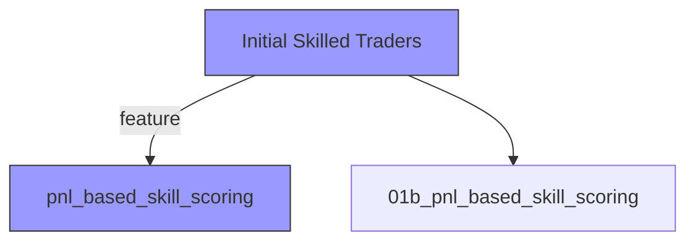

# Analysis: pnl_based_skill_scoring

**Stage ID:** `01a_pnl_based_skill_scoring`
**Path:** Initial Skilled Traders -> pnl_based_skill_scoring
**Generated:** 2026-02-13 15:03 UTC
**Confidence:** 45%

## Summary

The PnL-based skill scoring stage identifies 93 skilled traders from 14,214 qualifying makers using a token-aware PnL methodology. However, two critical data quality issues undermine the results: (1) the analysis only considers maker-side trades, missing ~40% of each trader's volume (median taker share is 40%), which means PnL estimates are systematically incomplete; (2) trading fees are not aggregated despite 16% of trades having positive fees. The core hypothesis that skilled traders differ from high-volume traders is partially supported (Jaccard overlap of 0.21), but the 60% consistency rate across periods with 4x volume growth is difficult to interpret.

## Key Insights

- Token-aware PnL methodology correctly accounts for unrealized gains from holding tokens to resolution - validated against specific positions
- Only 34.4% of top-PnL traders overlap with top-volume traders (Jaccard=0.21), supporting the hypothesis that PnL skill differs from volume
- Top skilled traders are predominantly buy-and-hold-to-resolution strategists - the #1 trader has 2,598 all-long positions with near-zero sell activity as maker
- Win rates cluster near 50% even for top PnL traders (mean 56.5%), suggesting PnL is driven by position sizing and price edge rather than directional accuracy
- Resolution confidence filter at 0.95 retains 94.3% of resolved markets, so this threshold is not overly restrictive
- 668,266 traders appear only as takers and are completely invisible to this analysis, potentially missing an entire class of skilled traders

## Concerns

- 2-sigma threshold on heavily right-skewed PnL distribution may not be appropriate - consider rank-based or log-transformed thresholds
- 93 skilled traders is a thin sample; statistical power for downstream analyses (e.g., strategy classification) will be limited
- Consistency metric uses 3 periods with dramatically different volume (P1: $1.1B, P2: $3.0B, P3: $4.7B) and active traders (112K to 298K), making cross-period comparison non-stationary
- Mean Sharpe ratio of 0.10 among skilled traders is very low, suggesting the PnL signal may be noisy and hard to exploit in a copy-trading strategy
- The analysis does not account for survivorship bias - traders who lost heavily may have stopped trading and not appear in later periods
- Multiple of the top-10 skilled traders have win rates below 50% but massive PnL - while potentially valid (large winning positions), this pattern should be verified as not a PnL calculation artifact

## Data Quality Issues

- **[!!!] CRITICAL**: Analysis only considers maker-side trades, but the median qualifying trader has 40% of their volume as taker. PnL is calculated only from maker trades, systematically missing buy/sell activity on the taker side. This means position sizes, entry prices, and net exposure are all incorrect.
  - Affected metric: estimated_pnl, pnl_per_dollar, win_rate_by_position, total_volume_usd
  - Suggested fix: Combine maker and taker trades for each wallet address (UNION of maker-side and taker-side activity with appropriate side mapping) before computing positions and PnL
- **[!!!] CRITICAL**: total_fees_paid is 0.0 for ALL 14,214 traders despite 27.9 million trades (16%) having positive fee_usd values. Fee aggregation is broken or was never implemented. For the top trader specifically, fees are genuinely $0 (maker fees may be zero), but this is not true for the population.
  - Affected metric: total_fees_paid, estimated_pnl (if fees should be subtracted)
  - Suggested fix: Aggregate fee_usd per trader and subtract from PnL. Separately track maker fees vs taker fees to understand fee structure.
- **[!!] WARNING**: unique_markets metric reports 4,482,054 which is actually the count of trader-market pairs, not unique markets. The actual number of distinct condition_ids traded in the period is 245,012. This is a labeling/reporting error.
  - Affected metric: unique_markets
  - Suggested fix: Rename to 'trader_market_pairs' or fix the aggregation to use count(DISTINCT condition_id)
- **[!!] WARNING**: 668,266 taker-only traders are completely excluded from the analysis. Some may be highly skilled but never appear as makers. The qualifying trader count (14,214) represents only maker-side traders.
  - Affected metric: sample_size, n_skilled_traders
  - Suggested fix: Include taker-only traders in the population by unioning maker and taker addresses
- **[i] INFO**: Markets table has no status='resolved' - resolved markets have status='closed' with non-null resolved_at. The analysis appears to use resolved_at correctly, but the schema assumption should be documented.
  - Affected metric: resolved_markets count
  - Suggested fix: Document that resolution is determined by resolved_at IS NOT NULL, not by status field

## Proposed Refinements

### 1. maker_taker_unified_pnl
**Type:** filter | **Priority:** 1/5 | **Complexity:** 4/5

Combine maker and taker trades per wallet to compute complete position-level PnL, fixing the critical data quality gap where ~40% of trading volume is ignored

**Hypothesis:** Unifying maker+taker trades will change the skilled trader set by >30%, as some traders appear skilled only because their losing taker-side trades are invisible, while others appear unskilled because their profitable taker trades are missed

**Expected Outcome:** A revised set of skilled traders with more accurate PnL estimates, potentially different composition, and higher confidence in the skill signal

### 2. pnl_per_dollar_ranking
**Type:** feature | **Priority:** 2/5 | **Complexity:** 2/5

Use PnL-per-dollar-invested (capital efficiency) instead of absolute PnL as the primary skill metric, to reduce bias toward large-capital traders

**Hypothesis:** Ranking by PnL/dollar will identify a distinct set of skilled traders with higher consistency rates (>70%) because capital-efficient traders are more likely to have repeatable edge rather than just large bankrolls

**Expected Outcome:** Higher consistency rate among skilled traders, lower overlap with volume-based ranking, and identification of smaller but consistently profitable traders

### 3. volume_adjusted_consistency
**Type:** parameter | **Priority:** 2/5 | **Complexity:** 3/5

Normalize sub-period PnL by period-specific market conditions (total volume, number of markets resolved) to account for the 4x volume growth across the analysis window

**Hypothesis:** Volume-adjusted consistency will produce a more reliable consistency metric, with the rate changing by >10pp compared to the raw metric, because the current approach conflates market growth with trader skill

**Expected Outcome:** A consistency metric that is more stable across different time periods and better discriminates between traders who are consistently skilled vs those who benefited from market expansion

### 4. log_pnl_skill_threshold
**Type:** parameter | **Priority:** 3/5 | **Complexity:** 2/5

Replace the 2-sigma threshold on raw PnL with a threshold on log-transformed or rank-percentile PnL to better handle the heavy right skew of the PnL distribution

**Hypothesis:** Using log-PnL or percentile-based thresholds will identify 20-40% more skilled traders who are obscured by the extreme right skew (std=$137K driven by outliers), producing a larger and more diverse skilled set

**Expected Outcome:** A larger skilled trader pool (150-200+) with more diverse trading styles, enabling better downstream strategy classification

### 5. position_sizing_skill_decomposition
**Type:** feature | **Priority:** 3/5 | **Complexity:** 3/5

Decompose PnL into prediction accuracy (win rate) and position sizing skill (avg win size vs avg loss size) to distinguish between traders who pick winners vs traders who size bets well

**Hypothesis:** Top PnL traders with sub-50% win rates derive their edge from position sizing (Kelly-like behavior), while those with high win rates derive edge from prediction accuracy. These two skill types will show different consistency profiles and tradeable signal characteristics.

**Expected Outcome:** Two distinct clusters of skilled traders: 'predictors' (high win rate, moderate sizing) and 'sizers' (moderate win rate, large asymmetric payoffs), each requiring different copy-trading approaches

## Exploration Tree

