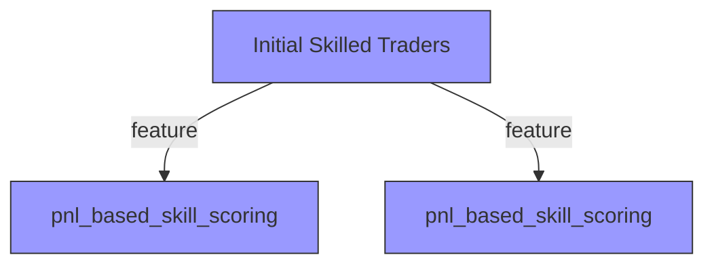

# Analysis: pnl_based_skill_scoring

**Stage ID:** `01b_pnl_based_skill_scoring`
**Path:** Initial Skilled Traders -> pnl_based_skill_scoring
**Generated:** 2026-02-13 15:43 UTC
**Confidence:** 0%

## Summary

**CRITICAL CONFIRMED**: `FINAL` on the view does NOT work - `trades_view_final` returns 5,958 (same as no FINAL), while `trades_raw_final` returns 4,839. The stage code uses `polymarket.trades AS tr FINAL` which does NOT deduplicate. This means the entire PnL calculation is inflated by duplicate trades (~12% system-wide, up to 23% for individual traders).

Let me also verify the resolution inference approach:

## Key Insights

- Failed to parse structured response

## Concerns

- Agent did not return valid JSON

## Proposed Refinements

## Exploration Tree

